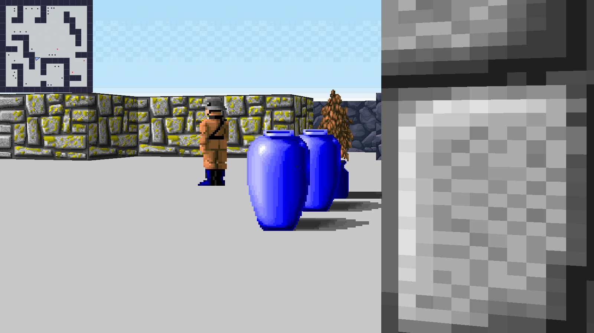
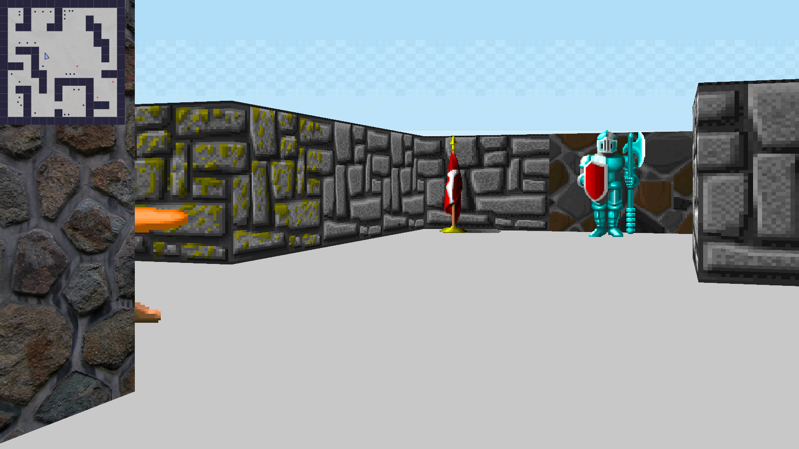

# Sandbox 
The sandbox is a raycasting engine in 2nd generation.
You can play the current Version [here](https://nichtgian.github.io/sandbox/).

FPS/Performance display: [stats.js](http://github.com/mrdoob/stats.js).

## Ambition
Sandbox is a in JavaScript and HTML Canvas developed raycast engine.
Future gamemodes can be limitless. The main focus relays on a smooth game experience,
versatile gamemodes. 

## Current State
Rendering of Walls, Sprites and Enemies. The resolution aswell as the FPS are high.
Most of the problems of the earlier engines are fixed.

## Next Steps
Implementing new features: 

- Touch Support / Improved Controls
- In depth Rendering including possible Floors, Variable Height Walls, Doors / Windows, Y- Axis View
- Guns & Bullet holes in walls, Graffiti
- Sprite Animations, Grenades

Possible Gamemodes:

- Prop Hunt
- FPS
- Coop Survival

For online gameplay a main lobby serves as serverbrowser. You can meet up with people here and join
public or create private servers. We'd like to implement a character or even weapon customisation. 

> Project is still in early development!

Licensed by NMFI - [Nichtgian Media Foundation Inc.](https://nichtgianmediafoundationincorporation.github.io/page/index.html) - high-end computer-software, better than google